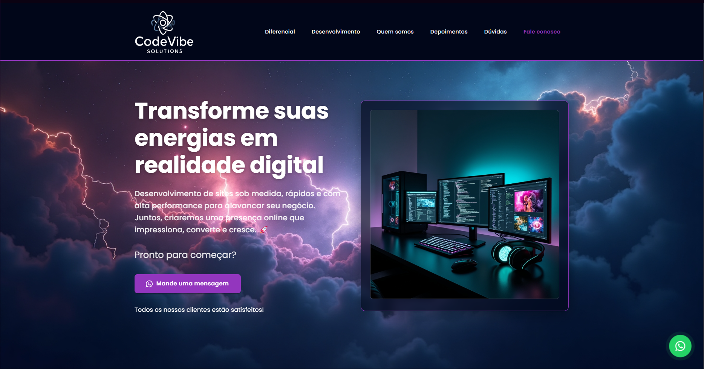
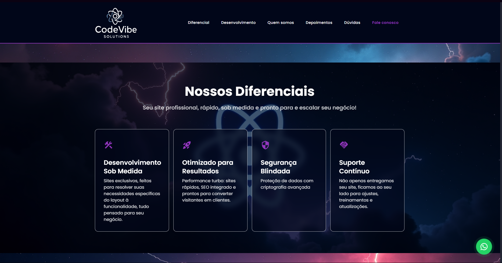
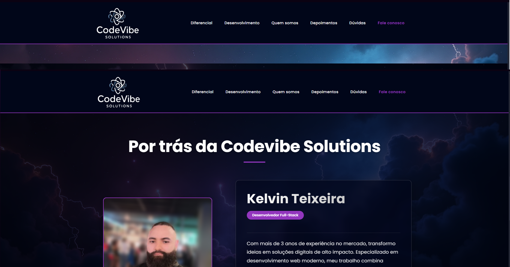

# 🚀 CodeVibe Solutions - Plataforma Digital Corporativa

## 💡 Sobre o Projeto

Aplicação web desenvolvida estrategicamente para **CodeVibe Solutions**, representando nosso compromisso com:

- **Excelência Digital**: Plataforma moderna que reflete nossa expertise em soluções tecnológicas  
- **Engajamento Cliente**: Experiência intuitiva que facilita o acesso a nossos serviços  
- **Transparência**: Apresentação clara de nossas capacidades e diferenciais competitivos  

Este projeto corporativo foi meticulosamente arquitetado para:  
✔ Consolidar nosso posicionamento de mercado  
✔ Otimizar processos de captação e relacionamento  
✔ Demonstrar cases e metodologias de trabalho  

<div align="center">
  
  
  
</div>

## ✨ Diferenciais Estratégicos

| Característica | Benefício |
|---------------|-----------|
| Design Institucional | Reflete profissionalismo e inovação |
| Arquitetura Modular | Facilita atualizações constantes |
| Performance Otimizada | Redução de bounce rate |
| SEO Aplicado | Maior visibilidade orgânica |
| Analytics Integrado | Mensuração de conversões |

> "Mais que um site, uma ferramenta estratégica para crescimento de negócios" - CEO CodeVibe

#### <div align="right">- Projeto Em andamento 🟢 <div>

## Tecnologias usadas

- React
- Typescript
- Material ui

## Requisitos

Para executar a aplicação é necessário instalar algumas ferramentas tais como um editor de códigos para realizar compilação dos mesmos. Nesse projeto foi utilizado o [Visual Studio Code](https://code.visualstudio.com/), [NodeJS](https://nodejs.org/en/) para compilação do código, [Git Bash](https://gitforwindows.org/) para baixar o repositório e baixar todas as dependências necessárias.

```bash
# Baixe o repositório.
$ https://github.com/kelvinteixeira/codevibe.git
# Acesse a pasta do projeto.
$ cd codevibe

# Agora que baixou e acessou o repositório, vamos começar a instalação das dependências.
$ yarn ( caso não utilize o yarn execute apenas npm install)

# Depois de instalado todas as dependências, abra a aplicação via vscode.
$ code .

# Agore execute a aplicação.
$ yarn dev (caso não utilize o yarn: npm run dev)

# A aplicação iniciará na porta 5173
# No navegador digite: http://localhost:5173/
```

#### <div align="center">Aplicação desenvolvida por mim. Gostou? tem alguma sugestão de melhoria? por favor, entre em contato e ja me adiciona. :D

<div>

<div align="center"> 
  <a href="https://instagram.com/kelvinteixeira_" target="_blank"></a>
  <a href = "mailto:kelvin.teixeira.santos@gmail.com"></a>
  <a href="https://www.linkedin.com/in/kelvin-teixeira-8707b41a8/" target="_blank"></a> 
  </div>
